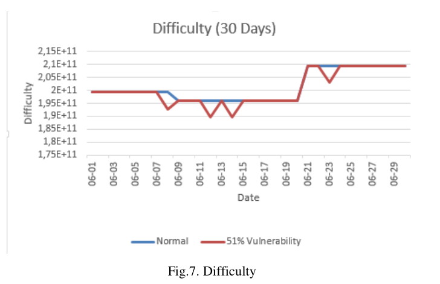

# Anomaly Detection Model Over Blockchain Electronic Transactions1

## 论文信息

- 论文名：Anomaly Detection Model Over Blockchain Electronic Transactions

- 领域：区块链电子交易异常检测模型

- 作者：Sirine SAYADI（突尼斯迦太基大学高等传媒学院）、Sonia BEN REJEB 、Sonia BEN REJEB 

- 发表年份：2019

- 会议/期刊名：IWCMC [2019 15th International Wirel...](https://ieeexplore.ieee.org/xpl/conhome/8761262/proceeding)

- 级别：EI

## ABSTRACT

#### 提出目前存在的问题

基于区块链的加密货币系统面临很多安全威胁。

#### 本文方法和创新点

提出了一个新的比特币电子交易异常检测模型。使用了两种机器学习算法，即一类支持向量机(OCSVM)算法来检测异常值，以及KMeans算法来将具有相同异常类型的相似异常值分组。我们通过生成检测结果来评估我们的工作，获得了高精度的高性能结果。

## INTRODUCTION  

#### 问题：

区块链技术面临着很多安全威胁，如分布式拒绝服务(DDOS)攻击,自私挖矿攻击、双倍花费攻击、51%漏洞等。

#### 目前解决方法：

- 现有的关于电子交易异常检测的研究工作较为普遍，其结果缺乏攻击类型的正确率和精度以及存在较高的误报检测率。

#### 本文提出(创新点)

1. 提出一个新的模型，在比特币电子交易中使用机器学习算法在两个阶段进行异常检测。
2. 在第一阶段，使用One-Class SVM方法检测离群值，在第二阶段，使用Kmeans算法根据相似度指数对离群值进行重组，以确定攻击类型。

## RELATED WORK  

- [2]中的R. Kumari和M. Catherine使用K-means算法对节点行为中的恶意活动进行监控和聚类，将具有相似特征的组从区块链网络中分离出来，然后将其分组，识别出恶意节点或任何非法活动。他们使用动态时间包装(Dynamic Time Wrapping)技术来计算相似性指数、事务花费的时间以及从一个节点到另一个节点的金额数量作为行为评级参数。

- A. Bogner[3]使用一种基于无监督学习算法的自动学习方法来优化异常检测。它们使用一个时间块中的平均事务数量、分布的块的时间、根据消耗的Gas的事务数量以及随着时间的推移每个块的Gas消耗量作为特征。

- Thai T. Pham和S. Lee[4]提出了一种检测比特币交易网络异常的方法，他们使用了三种非监督学习方法;k-均值、马氏距离和无监督支持向量机(SVM)。

- M. Signorini等人提出了一种利用区块链元数据收集恶意活动的区块链异常检测(BAD)解决方案。其思想是收集以恶意事务形式注入的本地攻击，并在以后重用它们，以防止对未受污染的节点进行类似的攻击。

- M. Zhang al.[6]描述了One Class SVM算法在网络上进行入侵检测的效率，具有更高的检测率和更好的准确率。

- A. Feder等人[7]研究了分布式拒绝服务(DDoS)攻击和其他中断对比特币交易数量和分布的影响。

## PROPOSED METHOD

#### 模型结构

- 

#### 阶段1：使用一类支持向量机进行新颖性检测

- 在一个空间中，One-Class SVM可以通过最大化这个超平面在原点处的距离来分离所有的原点数据点。因此，得到一个二进制函数，该函数捕获输入空间的区域和这些区域中数据的概率密度。根据训练数据，这个函数在正常区域返回+1，在其他地方返回-1。

- 一类支持向量机的决策函数g(x)g(x)g(x)定义如下：

- 根据决策函数的符号，定义了正态点和离群点。决策函数的大小与到决策边界的距离成正比。

#### 第二阶段：使用K-means聚类相似的离群值

- 将一组点n(x1,x2,…,xn)n(x_1,x_2,\dots,x_n)n(x1,x2,…,xn)划分到kkk个聚类S={S1,S2,…,SK},K≤nS=\{S_1,S_2,\dots,S_K\},K \leq nS={S1,S2,…,SK},K≤n，划分规则是使每个类中点与点之间的距离和最小。

- 只使用第一阶段One Class SVM的负值输出点，作为第二阶段K-means算法的输入数据，以聚类S类中的这些离群值。

## EXPERIMENTAL RESULTS  

#### 数据收集与解析

- ① 本文使用的比特币交易数据是由比特币区块链上的一个[数据源](https://www.blockchain.com/charts.)获得的。该数据集包含从2009年1月3日开始的各种比特币货币统计数据。

- ② 该数据集包含33个时间序列中的90514个值，例如(销毁比特币天数、累计销毁比特币天数、区块链大小、交易量成本、每笔交易成本、难度、估计交易量、估计美元交易量、哈希率、市值、市场价格(美元)、交易确认时间中值，矿工返回，我的钱包每天的交易数量，我的钱包用户数量，我的钱包交易量，孤立块数量，交易数量，不包括热门地址的交易数量，每个区块的交易数量，使用的唯一比特币地址数量，流通比特币总量、总产出、总交易费用、交易量与交易量之比、美元交易所交易量等)。使用上述这些数据作为异常检测模型的一组正常行为数据。异常数据由人工创建，模拟了对区块链安全威胁较大的一些攻击。

#### 特征选择

1. 根据某些类型攻击的行为来选择特征，同时根据它们对特征集合的反应来选择特征。
2. 选择出的特征如下：
   - 区块链的大小
   - 难度随时间变化。难度是衡量找到一个新方块与最容易的方块相比有多困难。
   - 哈希率：比特币网络每秒执行的估计哈希数(每秒数十亿哈希)。
   - 交易量：总输出量加上一个算法，试图从总值中删除变化。
   - 交易确认时间中位数：交易被挖掘的区块接受并添加到公共账簿的中位数时间。
   - 每天独特的比特币交易总数。
   - 区块平均大小

#### 评价方法

- 数据归一化

- 在数据归一化后，为了检测异常事务上的异常值，我们将训练数据和测试数据进行了分割。对于输出决策的每种类型，OCSVM异常检测模型都会得到一个分数，如果数据正常，则为(1);如果数据异常，则为(−1)。

- 在k-means算法中使用得分为(−1)的离群值数据来验证和聚类类似的异常，这是通过计算检测到的离群值之间的模拟指数来实现的。

#### 实验结果

- 使用Python开发合适的程序，在第一阶段使用Spyder编程API，在第二阶段使用框架Anaconda和Orange3 API。

- 对于每种攻击类型，将特征的反应变化可视化。例如，对于DDOS攻击，我们在图2中注意到与正常事务相比区块链大小有所增加。我们还注意到，在图3所示的DDOS攻击中，事务量出现了急剧的峰值。图4中的平均块大小略有增加，并且达到峰值，这解释了图5中由于DDOS攻击而导致的事务数量急剧增加。

- 在6月7日、13日、16日、20日、21日和22日，可以注意到正常流量和DDosed流量之间的区别，我们模拟了DDOS攻击对正常流量特征的反应。我们可以在图2中看到区块链大小的增加，在图3中看到事务量的急剧峰值，在图4中看到块大小的增加，在图5中看到事务数量的峰值。

- 对于Double spending攻击，我们在图6中注意到，在6月2日、10日、17日、18日和19日的中值事务确认级别有所增加。这是因为攻击者为了启动另一个交易，会利用很长时间来确认一个交易。

- 对于51%漏洞攻击，如图7所示，在此类攻击发生时的6月8日、12日、14日和22日，在难度计算水平上出现了下降。这里的攻击者利用难度算法的便利性来插入一个51%难度的攻击。

- 我们有16个异常，由3种类型的攻击组成：6次DDOS攻击，6次双倍费用攻击和4次51%漏洞的攻击。在第一阶段，使用OCSVM算法检测到15个异常。利用第二阶段的Kmeans，我们成功地将第一阶段检测到的异常聚在3个聚类中。

#### 绩效评估

- 对于阶段1，我们在测试数据集和包含异常的数据集上测试了我们的检测方法。总共插入2190个数据进行培训。我们使用548个数据进行测试，其中16个数据包含异常。

- 用表1中的混淆矩阵来描述我们的检测结果。在这次运行中，我们成功地发现了15个包含异常的事务，只生成了1个假阴性的事务。然而，检测到54例为假阳性。

- 在表II中评估了OCSVM异常检测模型的性能。依次给出真阳性率(TPR)为0.99，真阴性率(TNR)为0.21，假阳性率(FPR)为0.78，假阴性率(FNR)为0.002，精密度为0.9。

- 为了评价第2阶段的结果，图11显示了3个簇:C1 4频次，C2 7频次，C3 4频次。

- 

#### 总结和思考( •̀ ω •́ )✧

- 假阳性率也太高了吧