# Graph Deep Learning Based Anomaly Detection in Ethereum Blockchain Network

- 作者：Vatsal Patel、 Lei Pan、Sutharshan Rajasegarar (迪肯大学信息技术学院)

- 发表年份：2020

- 会议/期刊名：[International Conference on Network and System Security](https://link.springer.com/conference/nss)

- 级别：EI

原文： 

<embed id="pdfPlayer" src="E:\Typora笔记\论文\Graph Deep Learning Based Anomaly Detection in Ethereum Blockchain Network 143-157.pdf" type="application/pdf" width="100%" height="600" >

## ABSTRACT

**提出目前存在的问题**

- 智能合约在网络中很容易受到攻击和财务欺诈。由于匿名性，在这个庞大的网络中识别异常是一项挑战。使用传统的基于机器学习的技术，如单类支持向量机和隔离森林，在识别以太坊交易中的异常时是无效的，因为它在捕获交易中的节点间或账户关系信息方面存在局限性。

**本文方法和创新点**

- 以太坊交易可以使用带有属性的图有效地表示，其中节点和边捕获了相互依赖关系。

- 在本文中，提出了一种基于单类图神经网络的异常检测框架来检测以太坊区块链网络中的异常。实验结果表明，与传统的基于非图的机器学习算法相比，该方法能够获得更高的异常检测精度。

## INTRODUCTION  

#### **问题：**

- 以太坊已经成为最大的区块链支持智能合约，并拥有强制性可编程交易，可自动执行货币转账。由于区块链的普及，网络中发生了数百万个交易，产生了大量的交易数据，这给网络中异常活动的检测带来了挑战。通过智能合约执行故障对智能合约的攻击会导致合约虚拟货币的巨大损失。例如，2016年6月，DAO (decentralized autonomous organization)攻击造成了超过360万ethernet的损失。DAO攻击是由智能合约的可重入性问题引起的。攻击者可以调用函数来调用或终止契约，从而导致契约中的货币损失。为了维护网络的完整性，识别影响网络安全的恶意节点和交易至关重要。

#### **以太坊相关知识点：**

- 以太坊网络中有三种交易活动，分别是货币转账、智能合约创建和智能合约调用。

- 以太坊的基本单位是账户/地址，它们被视为独立的实体。这些地址采用十六进制十进制格式，每个帐户都是唯一的。以太坊中使用两种主要类型的账户，即外部拥有的账户和智能合约。它们之间唯一显著的区别是，智能合约是可编程的交易，在稍后的阶段执行。

#### **本文提出(创新点)**

1. 考虑到以太坊区块链数据的复杂性，使用图数据结构对以太坊区块链网络进行建模。一个图可以用唯一的帐户地址作为节点集V，节点对之间的关系或事务作为边e来构建。数据实例之间的边描述了一个关系，执行图分析可以捕获长期的相关性。
2. 使用OCGNN(单类图神经网络)提出了以太坊区块链的异常检测框架。
3. 评估公开可用的以太坊数据，以证明与非基于图的方法相比，框架准确检测攻击的能力。

## RELATED WORK

**传统的、非基于图的技术**

**基于图的技术**

## PROPOSED METHOD

#### **模型结构**

本文提出的以太坊区块链异常检测框架如图1所示。该过程包括以下三个步骤:

- 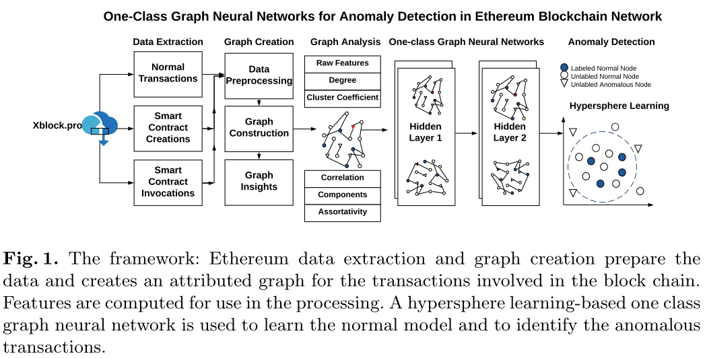

**数据提取**：处理以太坊区块链交易数据，提取正常交易、智能合约创建、智能合约调用三组数据。从数据中计算出20个特征，如表2所示。

- 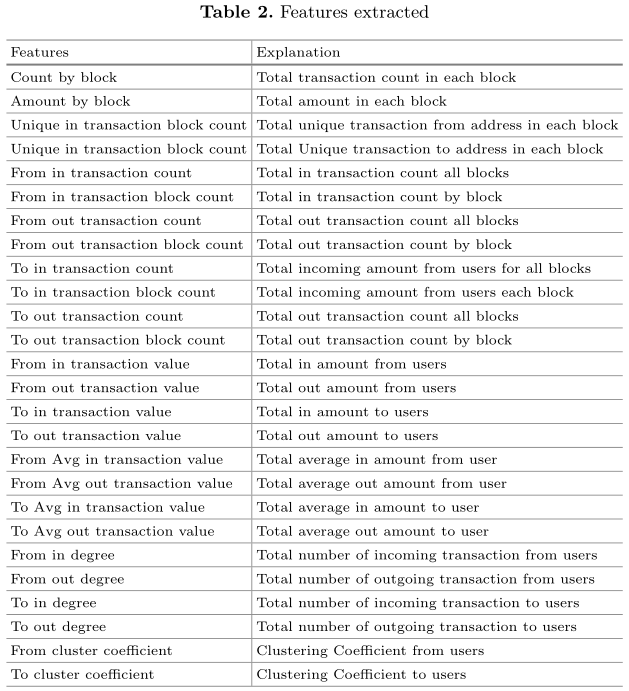

**图创建**：使用数据创建带属性的图。图中的节点是发送方和接收方的地址，即帐户。图的边是发送方和接收方唯一对的集合。边缘显示了进入交易的两个节点/帐户之间的关系。基于图的特征被计算并用于处理。表2的最后六行显示了从图中提取的特征。

**基于深度学习的异常检测**：将得到的图放到一类图神经网络中，学习正常行为，识别异常。

#### **定义**

**图结构**：

- 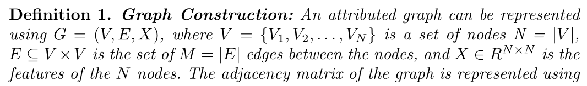
- 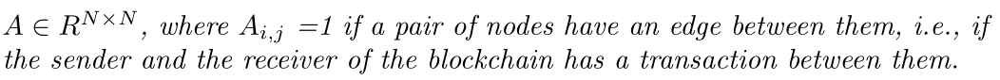

**基于超球体学习的相关概念**

基于超球的学习概念在文献中被广泛应用于异常检测。**支持向量数据描述**(SVDD)是一种用于检测真实世界数据中的异常的算法，其中异常的性质是未知的。

**SVDD的主要目标**是在特征空间Fk中找到一个中心$c∈F_k$，半径$r > 0$的紧凑的超球，捕获了大部分的数据点。数据空间表示为$X⊆R^d$，数据空间$X$到高维特征空间$F_k$的映射函数表示为$φk: X→F_k$。将数据映射到特征空间的正定核函数记为$k: X × X→[0，∞]$。SVDD解决了给定数据集$X_k = \{x_i∈X, i = 1,2，…K\}$的以下优化问题：非负松弛变量$ξ_i$允许部分异常落在正态区域内，因此可以得到一个广义训练模型。远离超球边界的数据点被视为异常。超参数$β∈(0,1)$控制着球体的体积和对异常的惩罚。通过求解下述优化，可以得到中心和半径的值，从而确定数据点是否在超球体内。如果某个数据点$φ_k(x_i)$)满足条件$||φk(xi)−c||^2_{F_k} > r^2$，则视为异常。

- 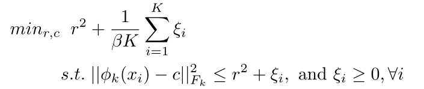

#### **OCGNN：单类图神经网络**

使用SVDD的超球学习有助于建立正态数据点的超球估计。将其与图神经网络(GNN)结合形成OCGNN框架。**OCGNN与超球一起学习图的结构信息**。GNN通过考虑节点属性及其相互关系自动学习节点嵌入。GNN既使用节点的邻接矩阵$A∈R^{N×N}$，又使用节点属性$X∈R^{N×D}$作为模型的输入学习节点嵌入向量$Z∈R^{N×F}$.

因此，模型的输入函数可以定义为$g(X, A;W)$表示一个图神经网络，它具有一组分层的权值$W =\{W_1，…, W^L\}$。$L∈N$是隐含层数。GNN第 $l$ 层的正向传播规则可以表示为:

- 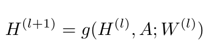

根据上述规则，$H(l)$为第l神经网络层的输入，$H(l+1)$为输出。对于第一层，节点属性集$X$为输入，等于$H(0)$。最终输出$H(L)$为节点$z$的嵌入矩阵。

GNN的节点嵌入和结构学习能力有助于提高任务的性能，如节点或图的分类和链接预测。

**OCGNN的主要目标是学习参数W**，取最小的数据描述超球，它是用半径$r∈R^+$，中心$c∈R^F$定义的。

给定图$G(X, A)$和$K$个训练节点$V_{tr}⊆V$，其中$K = |\{i: v_i∈V_{tr}\}|$，损失函数可表示为:

- 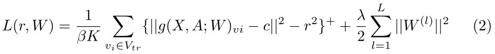

**OGCNN模型以图结构形式将节点和边作为输入信息，输出节点嵌入矩阵$Z = g(X, A;W),Z∈R^{N×F}$**。而在计算损失函数时，只使用$K$个节点嵌入$\{Z_{v_i}, v_i∈V_{tr}\}$。等式2中第一项表示惩罚。如果数据点与中心$c$之间的距离大于定义的半径$r$，则将该数据点视为异常点，因为它位于超球体之外。球的体积和惩罚之间的权衡是由超参数$β∈(0,1)$控制的。由于SVDD模型的目标是最小化球体的体积，因此在方程中引入了第二项$r^2$。

#### **变异的OCGNN**

由于OCGNN是一种基于图神经网络的异常检测框架，**使用任何合适的GNN层可以形成许多变体**，如图卷积网络(GCN)、图注意网络(GAT)和GraphSAGE。

#### **模型优化**

训练OCGNN模型涉及三个主要参数：权值矩阵W、中心c和半径r。采用随机梯度下降法对具有BP (BP)的单类目标的GNN模型的W进行优化。由于半径r不是OCGNN网络的内部参数，因此很难进行优化。因此，在训练阶段使用附录中列出的算法1对r和W进行单类处理和优化。

- 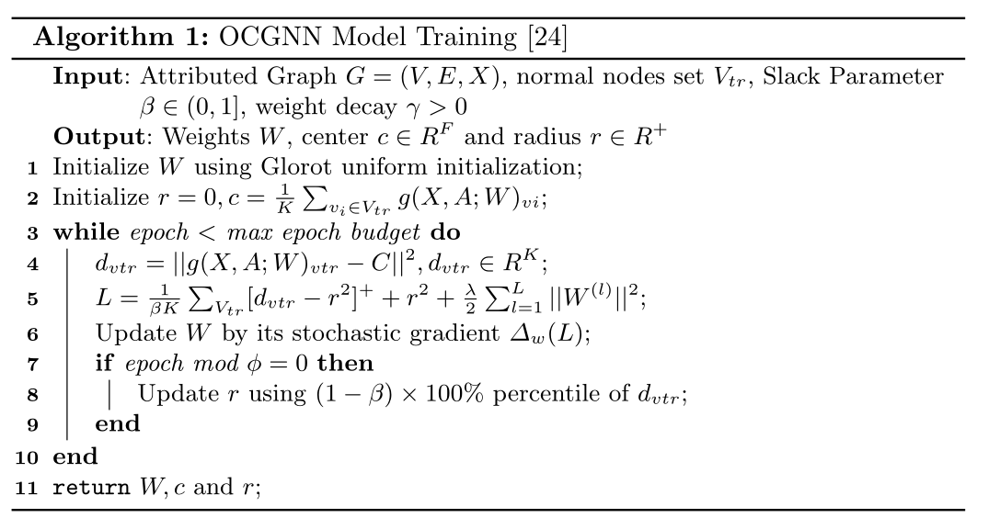

## EXPERIMENTAL RESULTS

#### **数据集**

1. 收集了[xblock.pro/Ethereum](http://xblock.pro/Ethereum)从2016年8月2日至2017年1月15日的所有以太坊外部交易数据。
2. 在以太坊，第一次攻击浪潮发生在2016年年中，已经手动标记了异常点，以便根据公开博客中提供的信息测试和验证本文模型的性能。该数据集包含“blockNumber”，“timeStamp”，“transactionHash”，“fromAddress”，“toAddress”，“value”，“gasPrice”，“gasLimit”，“gasUsed”和“gas”变量。
3. 攻击相关事务标记为1，正常事务标记为0。为了评估模型，对数据集进行了次采样，从685,706个唯一地址中挑选了25,257个唯一地址，如表1所示。从总计730万笔交易中，我们选择了50,422笔交易，确保每一对发送者/接收者都是唯一的，并为这些交易对计算出特征。在25257个节点中，正常节点为9185个，异常节点为16072个。模型中使用的数据集进一步分为训练集、验证集和测试集(训练/val/test)，如表1所示。评估中使用的数据集可以从[GitHub2](https://github.com/vatsalpatels/Graph-DL-Based-Anomaly-Detection-in-Ethereum.git.)获得。

- 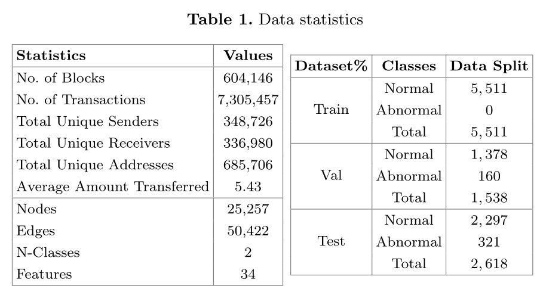

#### **特征提取**

- 为了估算给定一对发送方和接收方执行的总事务，首先使用所有730万个事务提取原始数据集特征。然后计算了各种特征，比如计算流入和流出的总量、每一对唯一的发送方和接收方转账的总金额和平均金额。原始和计算的特征然后编译在一个数据帧，以执行进一步的数据预处理。计算的特征列在表2中。

#### **Ethereum图数据**

- 利用数据集提取两组信息形成图，即边和特征。这些边包含一组唯一的发送方和接收方对。这条边展示了进入交易的两个节点之间的关系。这些边被转换成一个矩阵，并以加权有向图的形式显示出来。通过多级处理将十六进制地址转换为数字，形成图形网络。

- 包含特征的数据集被构造成在第一列中有一个唯一的接收地址和发送地址的列表以及它们的特征。所有这些特性和地址(节点)也将从十六进制值转换为十进制整数值以进行矩阵转换。

- 图网络的度分布如图2所示。

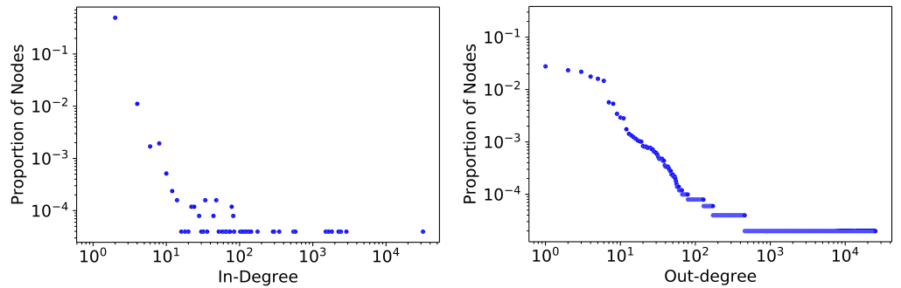

#### **算法对比**

- 使用传统的基于非图的算法(Euclidean Data-based算法)，如**One-class SVM (OCSVM)和Isolation Forest (Forest)进**行异常检测，并与OCGNN模型进行比较。

- 利用任何合适的层(即GNN的变体)可以形成一类图神经网络模型来进行图异常检测。为了评估OCGNN的性能，我们使用了三个性能最好的模块，即GraphSAGE、GAT和GCN

- **模型初始化时采用格罗洛均匀权值，并使用随机梯度下降法(SGD)进行优化，**学习率为0.001。在训练模型时，根据层次、β和时代，在$5 × 10^{−3}$到$5 × 10^{−6}$之间使用了权值衰减。该模型是基于损失函数和AUC评分设计的一种早期停止策略。

- **使用了不同范围的epoch，从100到1000训练模型，使用三种不同的随机种子来验证模型的性能。**对于GAT，我们使用了4层，每层33个神经元，而对于GraphSAGE和GCN，我们使用了2层，每层32个神经元。对于每个模型，输出层尺寸是隐藏层尺寸的一半，使用dropout参数移动到下一层。对于GraphSAGE，聚合类型是默认的，并设置为池，对于GAT层，注意头设置为8。阈值由数据点到球体中心的距离决定。

#### **结果**

- 表3中记录了用于训练模型的不同级别的训练数据集的所有模型的性能度量。表格的第一列显示了用于学习正常行为的正常数据(训练)的百分比。分阶段减少训练数据集并进行实验的目的是衡量模型的性能，即使是使用最低的可用数据进行训练。

- 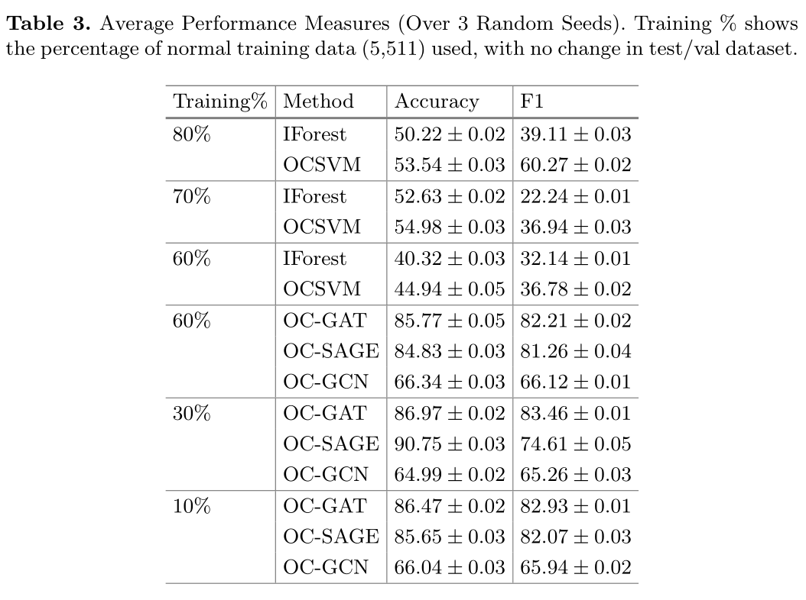

- 表中显示的结果表明，OCGNN在准确率和F1评分方面都优于传统的异常检测算法。损失曲线和ROC曲线的证据进一步证实了这一点，如图3所示。

- 在传统算法中，OCSVM的性能优于隔离森林算法。OCSVM和Isolation Forest报告的准确性和F1评分是三个随机重复的平均值。在数据分割率为70-30%的情况下，OCSVM的准确率最高，达到54.98%，隔离森林为52.63%。这些结果表明，在训练数据集较低的情况下，传统模型难以检测异常。当选择用于训练模型的数据的比例变小时，准确率会下降。

- 另一方面，即使我们使用10%的数据来训练模型，基于超球学习的GNN模型的性能仍然很高。OC-GAT模型表现最好，总体精度为86%，OC-GraphSAGE模型次之，平均精度为85%。OC-GAT和OC-GraphSAGE的F1评分分别为83%和82%，这两个模型的准确性得到了很好的支持。从损失曲线来看，两种模型都表现出良好的性能，没有出现过拟合或欠拟合的迹象。当在训练数据集为10%的模型中进行训练时，OC-GraphSAGE模型和OC-GCN模型的损失曲线出现变化，但OC-GAT模型的损失曲线保持平稳。可以通过调优参数进一步优化这个变化。与OC-GAT相比，OC-GraphSAGE具有更好的性能和平滑的损耗曲线。在三次随机重复中，AUC得分均接近98±1.0。

- 在OCGNN组模型中，OC-GCN模型表现最差。对于复杂的数据结构，优化OC-GCN的超参数是非常困难的。OC-GCN是一种拉普拉斯平滑，它要求层数最低，因为该模型使用多层训练具有相当大的挑战性。同时，反复使用拉普拉斯平滑法可能会使特征混合，使其难以区分。我们在该模型中只使用了两层来训练OC-GCN，因此OC-GCN的性能较好。OC-GCN的准确率最低，为66%，F1得分为66.12%。如果我们用10%的数据来训练模型，精度保持不变;但对损失曲线和AUC评分有负面影响。为了进一步优化，使用自我训练和GraphMix的概念可能会显著提高结果。

- 基于超球的学习方法的能力是通过使用不同数量的数据训练模型，从10%到60%的训练数据，其中包括一组正常的事务。基于超球学习的方法即使在训练数据很少的情况下也能很好地工作，并且仍然能以较高的准确率检测异常。从表3可以看出，OCGNN的性能保持一致。当我们仅用10%的数据训练模型时，损失曲线会受到影响，但可以进一步优化。

#### 总结和思考( •̀ ω •́ )✧

- 未来，为了应对实时检测以太坊中出现的异常活动的挑战，除了一个类方法外，还可以分析增量式、多阶段的图嵌入过程来进行异常检测。

